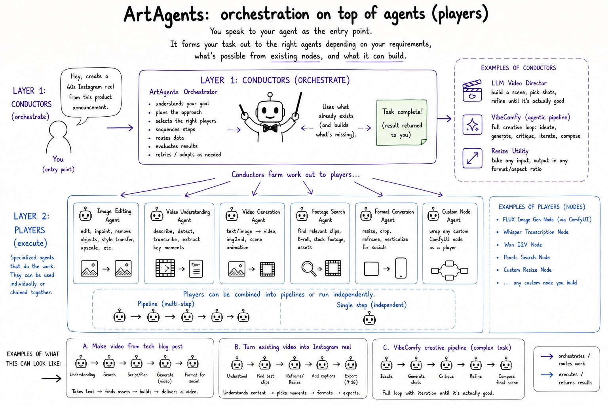

# ArtAgents



ArtAgents is a file-based toolkit for producing Reigh-compatible video edits,
event-talk renders, generative timelines, and image/video assets.

The core idea is simple: **conductors orchestrate**, **players execute**.
You ask an agent for an outcome, and ArtAgents routes the work through the
right existing nodes or newly built nodes.

## Agent Prompt

Copy this into a coding agent:

```text
Use the ArtAgents repo. Read README.md and SKILL.md first, run git status --short, keep generated files under runs/, do not commit secrets or media, and run: python3 pipeline.py --brief brief.txt --out runs/example --render. While working, call out friction points, suggest fixes, and recommend PRs to the original upstream repos when the right fix belongs there rather than as a local workaround.
```

## Quick Start

```bash
# Source-video hype cut
python3 pipeline.py --video source.mp4 --brief brief.txt --out runs/example --render

# Audio-backed timeline
python3 pipeline.py --audio rant.wav --brief brief.txt --out runs/audio --render

# Pure-generative timeline
python3 pipeline.py --brief brief.txt --theme 2rp --out runs/generative --render --target-duration 28

# Event-talk render
python3 bin/event_talks.py render --manifest runs/event/talks.json --out-dir runs/event/rendered
```

Generated outputs belong under `runs/`. That directory is ignored by git and can
contain frames, JSON files, audits, and rendered videos from local experiments.

## Main Commands

```bash
# Rerun a pipeline from a specific stage
python3 pipeline.py --video source.mp4 --brief brief.txt --out runs/example --from cut --render

# Audit a run
python3 pipeline.py audit --run runs/example
python3 pipeline.py audit --run runs/example --json

# Inspect available conductors and performers
python3 pipeline.py conductors list
python3 pipeline.py performers list

# Fetch canonical Reigh data through the app Edge Function
python3 pipeline.py reigh-data --project-id <PROJECT_UUID> --shot-id <SHOT_UUID> --out runs/reigh/shot.json

# Render a Reigh-compatible timeline/assets pair
python3 bin/render_remotion.py \
  --timeline runs/example/briefs/my-brief/hype.timeline.json \
  --assets runs/example/briefs/my-brief/hype.assets.json \
  --out runs/example/briefs/my-brief/render.mp4
```

## Repo Map

```text
artagents/             Python implementation
artagents/conductors/  Workflow orchestration
artagents/performers/  Executable player actions
bin/                   Direct stage launchers
remotion/              Remotion renderer project
scripts/               Development and code-generation scripts
examples/              Small schema fixtures
_reference/            Copied Reigh contract references
runs/                  Ignored local outputs
```

`pipeline.py` is the primary entry point. `bin/*.py` launchers call the matching
modules under `artagents/` when you need a single stage directly.

## Outputs

The main pipeline writes source-level artifacts into the run directory and
brief-level artifacts under `briefs/<slug>/`:

```text
runs/example/
  transcript.json
  scenes.json
  shots.json
  pool.json
  audit/
  briefs/
    my-brief/
      arrangement.json
      hype.timeline.json
      hype.assets.json
      hype.metadata.json
      hype.mp4
      validation.json
```

## Development

```bash
python3 -m pip install -r requirements.txt
pytest

cd remotion
npm run typecheck
npm run smoke
npm run gen-types
```

Run `npm run gen-types` after effect, animation, or theme primitive changes.

Local secrets belong in `.env`, `.env.*`, or `this.env`; these are ignored by
git. Large source media and generated artifacts should stay under `runs/` or
another ignored output directory.

## License

Open Source Native License (OSNL) v0.2. See `LICENSE` for the full terms.
